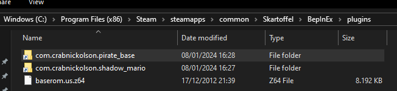

# Shadow Mario

This is an unofficial [BepInEx](https://github.com/BepInEx/BepInEx) plugin for [Shadow Gambit](https://store.steampowered.com/app/1545560/Shadow_Gambit_The_Cursed_Crew/) that lets you play as Mario's incarnation from Super Mario 64.

[](https://youtu.be/q3AZxYEleCs)

## Installation

### Before you start
- This plugin has only been tested with the Steam version of Shadow Gambit 1.2.133 on Windows. Other versions may or may not work.
- This plugin might break your save profile. If you care about your save, create a new save profile before installing this plugin.

### What you need
- [Shadow Gambit](https://store.steampowered.com/app/1545560/Shadow_Gambit_The_Cursed_Crew/)
- [BepInEx 6](https://builds.bepinex.dev/projects/bepinex_be)
	- Click on the newest artifact and then download "BepInEx Unity (IL2CPP) for Windows (x64) games".
	- If you can't run the plugin with the latest BepInEx artifact, try using artifact #682 instead.
	<br>
- [Pirate Base Plugin](https://github.com/CrabNickolson/pirate_base_plugin/releases/latest)
	- Download "com.crabnickolson.pirate_base.x.x.x.zip".
- [Shadow Mario Plugin](https://github.com/CrabNickolson/shadow_mario_plugin/releases/latest)
	- Download "com.crabnickolson.shadow_mario.x.x.x.zip".
- Super Mario 64 (USA) ROM File
	- You'll have to figure out where to get this yourself (SHA256: 17ce077343c6133f8c9f2d6d6d9a4ab62c8cd2aa57c40aea1f490b4c8bb21d91).
- A controller (Mario cannot be controlled with Keyboard/Mouse).

### Steps
1. Make sure you have all of the required files from the "What you need" section above ready.
2. Make sure Shadow Gambit is not running.
3. Open Shadow Gambits game folder by right clicking on the game in Steam and selecting "Manage > Browse Local Files".
4. Unzip the BepInEx folder into the Shadow Gambit game folder. It should look like this:
	<br>
5. Unzip the 2 plugin folders into `[game folder]\BepInEx\plugins`.
6. Copy the Super Mario 64 ROM file into `[game folder]\BepInEx\plugins` and rename it to "baserom.us.z64". The plugins folder should look like this:
	<br>
7. Start the game as you normally would and wait for a couple of minutes.
	- Only the first time starting the game after installing the plugin takes a while. Subsequent game starts should be quicker.

## Usage
1. Load into any mission.
	- Try the Treasure Hunt mission of smaller locations like New Krucbury or Twins of Nerechtemeresch first.
	- [Or try this modded mission](docs/shadow_mario_demo_mission_00.save)! See if you can find all 8 stars. [Here is a guide on how to install modded missions.](https://mod.io/g/shadow-gambit/r/how-to-play-a-mod)
2. Select your spawn location and characters and start the mission.
3. Select the player character you want to replace with Mario and hold the right stick down for 3 seconds.
4. The game will freeze for a while (this can take a couple of minutes in the bigger missions).
5. There should now be an Italian plumber in your game!
6. You can repeat this process with other player characters to spawn multiple Marios, however this has a heavy performance impact!

 

### Gameplay
- Move with the Left Stick.
- Jump with A (Xbox) or X (PS).
- Punch with X (Xbox) or Square (PS).
- Stomp/Crawl with the Left Trigger/Bumper.
- You should be able to save and load as normal.
- You can use some objects (chests, environment kills, doors, etc) by punching them.
- NPCs are at first only knocked out by Mario. You need to ground pound/slide into them again to kill them.
- You can pick up and throw incapacitated NPCs (like Bowser) by punching next to them.
- You can revive other players and Marios by ground pounding them.
- Use the teleport cheat if you get stuck (hold Left D-Pad + Right Bumper).
	- If this does not work you probably don't have cheats enabled. You can do so by opening the game's properties on Steam and adding `thisisnotsupported2` to the launch options. Then restart the game.

### Save Editing
- You can use the [Modding Tools](https://mod.io/g/shadow-gambit/r/getting-started) to place obstacles, blocks, coins and stars.
- To open the modding tools press Ctrl + Alt + M.
- To spawn objects:
	- Select the "Mario" tab in the Modding Tools window.
	- Select one of the following: Coin, Star, Block Fly, Block Metal, Obstacle Ice, Obstacle Lava.
	- Right click in the scene to spawn your selected object.
	- You can left click spawned objects to select and move them.
	- Performance gets wonky if you spawn too many objects, so be careful!
- To spawn obstacles:
	- Select the "Spawn" tab in the Modding Tools window.
	- Select any obstacle and spawn it with right click.
	- Select the "Mario" tab.
	- Marios physics work best, if walls are at 90º angles. Press the "Snap Rotation Of Selected" button to help with that.
	- Click "Regenerate Terrain". You must click this every time you add or move an obstacle.
		- Stars/Coins/Item Blocks are NOT obstacles, so you do not need to regenerate the terrain for them.
- You can export your Save Mod as you normally would. However, people that want to play your mod will also need to have the Shadow Mario plugin installed.

### Config
There is a config file at `[game folder]\BepInEx\config\com.crabnickolson.shadow_mario.cfg`. It contains options to change Mario's gameplay and also some options to tweak performance. Although be careful when you modify the latter, since those can cause the game to become inoperable.

### Scripting
The following MiScript commands are available:
```
sm64-get-selected-mario -> character

sm64-give-normal-cap <character>
sm64-give-metal-cap <character> <float(duration)> <bool(play-music)>
sm64-give-fly-cap <character> <float(duration)> <bool(play-music)>

sm64-spawn-star <v3(position)> <bool(play-music)>
sm64-reset-star-counter

sm64-spawn-coin-static <v3(position)>
sm64-spawn-coin <v3(position)> <v3(velocity)> <float(lifetime)>
sm64-spawn-coin-multiple <v3(position)> <v3(velocity)> <v3(spread)> <int(count)> <float(lifetime)>
sm64-reset-coin-counter
sm64-coin-star-amount <int(amount)>

sm64-list-music
sm64-play-music <string(music-name)>
sm64-stop-music

sm64-list-sounds
sm64-play-sound-global <string(sound-name)>
sm64-play-sound <string(sound-name)> <v3(position)>

sm64-ocean-is-lava
```

## Known Issues
- The game sometimes crashes, usually when exiting a mission.
- Performance gets bad, when many objects are spawned.
	- This can be fixed sometimes by saving and loading.
- Water level in Iron Bay is broken.
- The game's music stops when you spawn the first Mario.
- Probably lots more.

## Acknowledgements
Thanks to the (former 🥲) Mimimi team for ideas. Thanks to Dominik Abé for making the Mario shader work with viewcones.

Used Libraries:
- [BepInEx](https://github.com/BepInEx/BepInEx)
- [libsm64](https://github.com/libsm64/libsm64)
- [Marching-Cubes](https://github.com/Scrawk/Marching-Cubes)
- [PirateBase](https://github.com/CrabNickolson/pirate_base_plugin)
